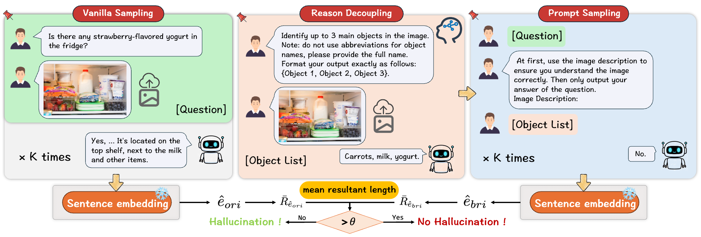

# DOUBT: Decoupled Object-level Understanding and Bridging via vMF-based Trustworthiness for Hallucination Detection in MLLMs

This repository provides the official implementation of our paper:
> Kaiqi Chen, Yang Qin, Changhao He, Xi Peng, Peng Hu
> *DOUBT: Decoupled Object-level Understanding and Bridging via vMF-based Trustworthiness for Hallucination Detection in MLLMs*, ICML 2026 (spotlight) 👉 [[Paper]](https://openreview.net/forum?id=QMf9CBpEIf&noteId=FyjOzt6FFy)

## Introduction

- **MLLM hallucination remains a fine-grained visual grounding challenge.** Although Multimodal Large Language Models have shown strong capabilities in visual perception and reasoning, they can still produce responses that are inconsistent with the image.

- **DOUBT detects hallucinations by decoupling visual understanding from answer verification.** Instead of relying solely on response-level uncertainty or semantic variation, DOUBT first extracts object-centric evidence from the image and then evaluates whether a candidate answer is supported by this evidence. This decoupled design makes the detection process more faithful to the actual visual content.

- **A vMF-based trustworthiness mechanism enables more robust estimation from limited samples.** Instead of relying on unstable statistics from a small set of MLLM responses, DOUBT models answer distributions with a vMF-based formulation, which provides a more reliable fit under limited-sample settings. This allows DOUBT to better estimate response trustworthiness and distinguish grounded answers from hallucinated ones.



## Requirements

We recommend using **Python 3.11**, **CUDA 12.x**, and **PyTorch 2.5.1**.

Install the dependencies with:

```bash
conda create -n doubt python=3.11 -y
conda activate doubt

pip install -r requirements.txt

wget https://github.com/Dao-AILab/flash-attention/releases/download/v2.7.4.post1/flash_attn-2.7.4.post1+cu12torch2.5cxx11abiFALSE-cp311-cp311-linux_x86_64.whl

pip install flash_attn-2.7.4.post1+cu12torch2.5cxx11abiFALSE-cp311-cp311-linux_x86_64.whl
```

## Usage
Run DOUBT with:

```bash
sh run/run_doubt.sh
```

## Citation
If you find our work useful in your research, please consider citing:

```bibtex
@inproceedings{chen2026doubt,
  title={DOUBT: Decoupled Object-level Understanding and Bridging via vMF-based Trustworthiness for Hallucination Detection in MLLMs},
  author={Kaiqi Chen, Yang Qin, Changhao He, Xi Peng and Peng Hu},
  booktitle={International Conference on Machine Learning},
  year={2026}
}
```

## Acknowledgement
This implementation is based on [VL-Uncertainty](https://github.com/Ruiyang-061X/VL-Uncertainty).